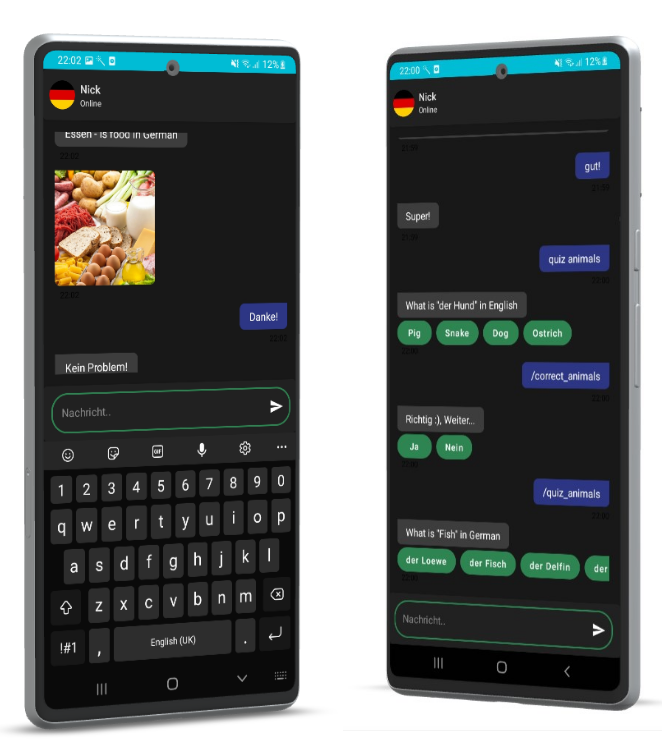

# German Learning Chatbot - Nick

This project was developed as part of a **university coursework**.  
It is a chatbot that teaches German through conversation. Users interact with the virtual assistant, **Nick**, via an Android application. The app is designed for beginners but can also be used by more advanced learners to practice German in a simulated human-like conversation, helping them gain confidence in real-world situations.

---

## Screenshot

*Example of the chatbot interface in the Android application.*

---

## Project Motivation
- Create a fun, easy-to-use, and interactive learning assistant.  
- Allow users to communicate with a chatbot through a mobile application anytime (24/7).  
- Encourage people to learn a new language, highlighting its benefits.  
- Provide a reliable learning resource for German language practice.

---

## Features
- Ask common questions, for example:  
  *“How do you ask for someone’s name or age?”*  
- Get to know **Nick**, the chatbot persona.  
- Learn vocabulary and grammar topics, such as greetings, food, animals, and weekdays.  
- Test your knowledge with multiple choice quizzes.  

---

## Methods Used
- **Rasa** – Open Source Conversational AI framework using NLP to determine responses.  
- **Android Studio** – Unified environment for Android app development.  
- **Okteto** – Cloud service used to host and train the chatbot.  
- **Kotlin** – Programming language used for Android app development.

---

## Who is Nick?
- Nick is the chatbot persona and virtual assistant the user interacts with.  
- Nick has unique traits, characteristics, and interests, making conversations engaging and realistic.  
- Users can get to know Nick by asking questions and having interactive conversations.

---

## Results
- A conversational assistant capable of teaching the basics of the German language.  
- Users can test their knowledge and receive feedback through multiple choice questions.  
- Simple, intuitive user interface with a contrasting color theme to indicate action importance.
